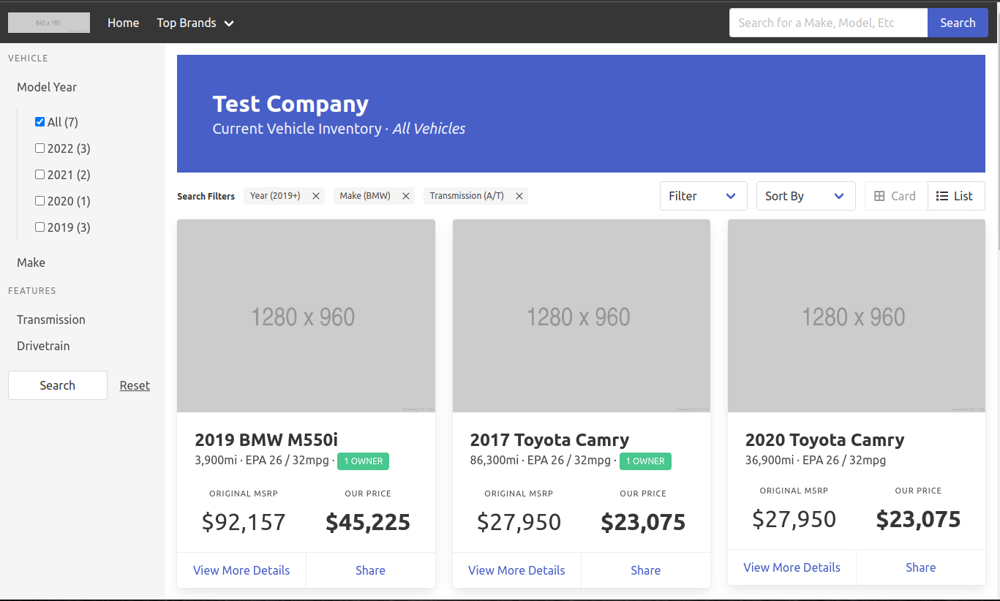
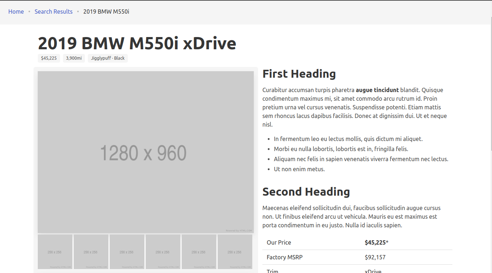
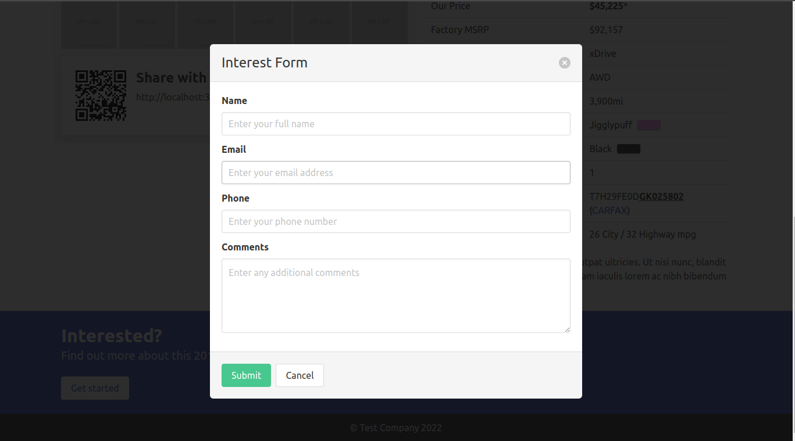

# Introduction

This is a comprehensive Automotive Vehicle Catalog/Listing application. The front-end relies strictly on Bulma styling, with a Node.js/Express backend. It is designed to be lightly focused on automotive vehicle listing, and could be easily reconfigured to focus on a different type of product.

# Core Features

- Inventory listing
- Vehicle Search filter design
- Live vehicle search box
- Inventory item page
  - Related item recommendations
  - Preview images
  - "Share with a friend" QR code
  - Key feature highlighting
- Call-To-Action email form
- ... Etc

# Previews







# Setup

## Basics

1. Get to the root folder

```bash
cd /automotive-vehicle-listing
```

2. Install packages

```bash
npm install
```

3. Rename `.env.example` to `.env` and update settings

4. Run Setup

```bash
npm run setup
```

(This will create the demo vehicles in your Firebase database)

5. Run server

```bash
npm start
```

6. Visit `http://localhost:3000` in your browser

## Firebase

This application relies on Google Firebase realtime database and storage for basic inventory management. The default structure of the database is below. You can import it directly to Google Firebase.

### Database Engine

Access rules:

```JSON
{
  "rules": {
    "inventory": {
      ".read": true,
      ".write": false
    }
  }
}
```

Database structure

```JSON
{
  "inventory": [],
  "inactive-inventory": []
}
```

### Storage Engine

N/A

# Requirements & Dependencies

- Google Firebase (Realtime DB and Storage)
- Bulma 0.93
- Font-Awesome 5.15.4
- Node.js, Express, & EJS
- Etc

# To-Do

- [ ] Fix live vehicle search box
- [ ] Fix "related item" recommendations
- [ ] Implement search filters
- [ ] Implement inventory listing "Share" card button
- [ ] Implement inventory listing filter (Sold/Available), display type (card/list), sort by (Price, age, etc)
